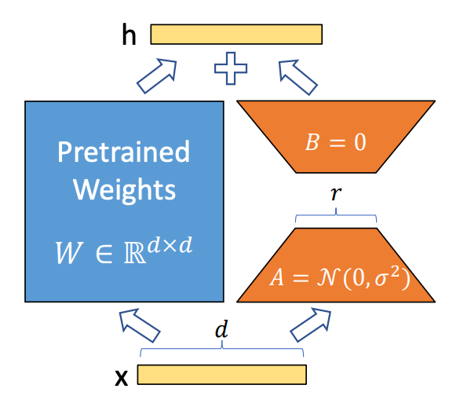

# aviation_accident_analyzer_llm
基于Qwen2-0.5B指令微调（SFT）的航空器事故分析器（数据来源于NTSB航空事故调查报告）

## 原始数据采集
航空事故调查报告来自于[NTSB官网](https://www.ntsb.gov/investigations/AccidentReports/Pages/Reports.aspx)，
编写爬虫（data/ntsb_crawl.py）爬取指定页数的报告并下载PDF。

## 指令数据集生成
编写指令prompt（见data/instruction_generator.py），调用DeepSeek-R1对话API为每个PDF生成4-8个指令数据对，每一对为如下json结构：  
```json
[
  {
    "instruction": "Analyze FDR data for stall warning activation sequence",
    "input": "Aircraft: B738, Flight Phase: Final Approach, Altitude: 1500ft AGL",
    "output": "FDR Parameter Analysis:\n- 23:45:11Z: STALL WARNING triggered (AOA 12.7°)\n- 23:45:12Z: IAS dropped to 124kt (Vref+5)..."
  },
  {
    "instruction": "Draft maintenance factor section for engine failure report",
    "input": "Event: Uncontained engine failure, Engine: CFM56-7B, Last Mx: 320 FH ago",
    "output": "Maintenance Review:\n1. Fan blade inspection records show...\n2. ESN 45122 had 2,983 cycles since last HSI...\nNTSB Recommendation: Implement ED-112 compliant..."
  }
]
```

## 数据预处理
- step1. 使用datasets库加载json格式的指令微调数据集；
- step2. 对每条指令数据，将其转换为Qwen2-0.5B的chat格式；
- step3. 对每条已转换为Qwen2-0.5B的chat格式的指令数据，构建input_ids、labels、attention_mask。

## 模型微调
本模型主要使用SFT-LoRA方式进行微调，指令数据构建时使用了Prompt Tuning。
1. 按训练所需调整的参数量分类微调方式
- 全量微调（FFT, Full Fine Tuning）：更新LLM所有参数，消耗资源大
- 参数高效微调（PEFT, Parameter-Efficient Fine-Tuning）：只更新部分模型参数，消耗资源少
> - LoRA（低秩微调，Low-Rank Adaptation）
> > 1. 对原始模型结构进行改动，引入旁路分支，微调时只训练旁路分支的参数；  
> > 2. 原参数矩阵为w，lora旁路输出为A * B，缩放因子为lora_alpha，整体输出则为w + (lora_alpha / r) × (A * B)
    设w.shape = [d, k]，则A.shape = [d, r], B.shape = [r, k], 其中r为所谓的秩大小；
> > 3. 其中A每个参数初始化时符合标准正态分布。
> > 
> - QLoRA（Quantization LoRA）：量化版的LoRA，每个参数使用int4表示
> - Prompt Tuning
> > 1. 基本原理：在原始prompt前加入适当的任务提示词，引导LLM生成期望输出；
> > 2. 实际使用：为数据预处理阶段，任务提示词为每条指令数据中role是system的部分。
> - Prefix Tuning
> > 1. 基本原理：在每一层Transformer的键值对（Key-Value）前插入可训练的前缀向量（prefix）。通过影响每一层的注意力机制调整模型行为，模型主体参数冻结。
> > 2. 与Prompt Tuning的区别：Prompt Tuning只在LLM输入层添加任务提示词，作为任务特定的上下文；而Prefix Tuning是在每一层Transformer的KV前插入可训练向量。
3. 按训练数据来源分类微调方式
- 指令微调（SFT, Supervised Fine Tuning）：利用标注数据进行有监督学习；
- RLHF微调：通过强化学习方式结合人类反馈进行微调，让LLM生成的结果更加符合人类的期望。

## 模型推理
1. 主要技术
- **KV Cache**：缓存解码器上次生成的KV矩阵，加快推理速度；
- **Flash Attention**：将输入分块并在每个块上执行注意力操作，减少对高带宽内存（HBM）的读写操作，加快推理速度。
2. 参数说明
- 重复惩罚（Repetition Penalty）：抑制重复词或短语的出现频率，值越高则重复词越少；
- 采样策略：推理时，LLM会给出对下一个词的预测概率分布，采样方式就是获取下一个词的方式
> - 多项式采样(Multinomial Sampling)
> > - 在每一时间步根据概率分布作为权重，随机选择单词；
> > - 可能会导致生成的文本不连贯和无意义。
> - 贪心搜索(Greedy search)：总是选择概率最大的词，可能导致生成的文本有很多重复词；
> - 束搜索(Beam Search)：
> > - 在每一个时间步，不只保留当前分数最高的1个输出，而是保留num_beams个。当num_beams=1时集束搜索就退化成了贪心搜索；
> > - 值越大，生成质量可能越高。
> - Top-K采样
> > - 从LLM预测的多个下一个词里选择k个作为候选，然后根据它们的**相似性分数**，从最可能的k个选项中随机选一个；如果k=3，模型将从最可能的3个词中选择一个；
> > - 值越高，LLM输出越多样。
> - Top-P采样/核采样(Nucleus Sampling)
> > - 动态截断候选词的概率分布，保留累计概率超过阈值 p 的词，避免选择极低概率的词;
> > - 值越低，LLM输出越固定。
> - 温度（Temperature）
> > - 在采样前调整每个词的概率分布；温度越低，概率分布差距越大，越容易采样到概率大的字；
> > - 值越高，生成的文本越随机。
> - 联合采样（实际工程使用）：使用的先后顺序是 Top-K -> Top-P -> Temperature。